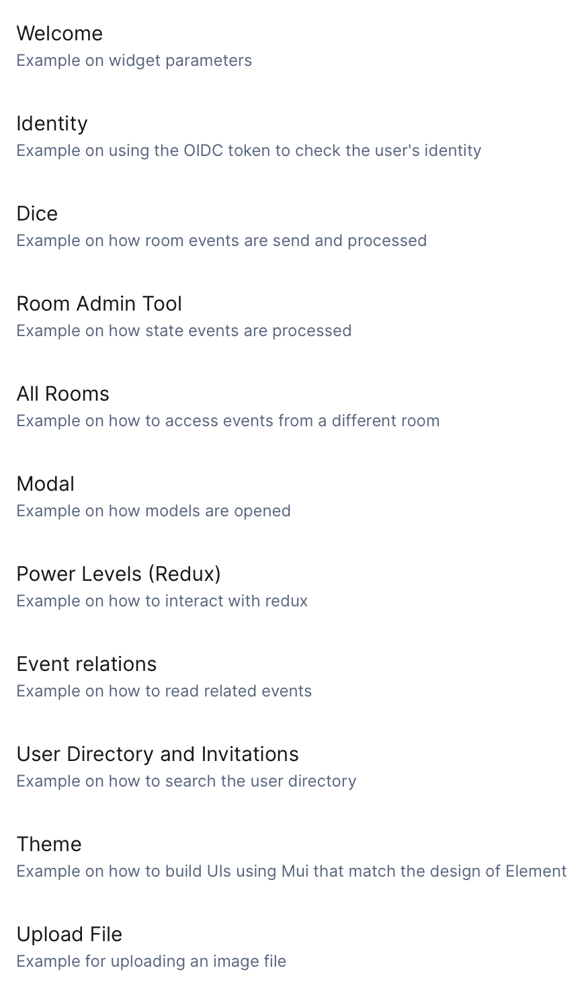

# Matrix Example Widget (Material UI)

This is an example that shows how you can write a Matrix/Element widget.
You can use this package as a starting point for writing new widgets.

The widget demonstrates:

- How to receive and send room events ([`DicePage`](./src/DicePage/DicePage.tsx)).
- How to receive and send state events ([`RoomPage`](./src/RoomPage/RoomPage.tsx)).
- How to use Redux for state management ([`PowerLevelsPage`](./src/PowerLevelsPage/PowerLevelsPage.tsx)).
- How to read data from all rooms ([`AllRoomsPage`](./src/AllRoomsPage/AllRoomsPage.tsx)).
- How to open widget modals ([`Modal`](./src/ModalPage/ModalPage.tsx)).
- How to use the UI components so the widget match the style of Element ([`Theme`](./src/ThemePage/ThemePage.tsx)).
- How to upload files to the media repository ([`Upload File`](./src/UploadImagePage/UploadImagePage.tsx)).
- And other examples…

## Demo

[Click here](https://example-widget-mui.widgets.demo.nordeck.io) and follow the instructions to see it in action.

## Running the Widget Locally

The widget is embedded into the widget host as an iframe.
This can cause mixed-content errors if your local widget is served _without_ HTTPS but the Element hosting it is running _with_ HTTPS.
You have multiple options to solve them:

- Run an own copy of [`element-web`](https://github.com/vector-im/element-web) locally (e.g. via Docker or by building `element-web` from source), _without_ HTTPS and start the widget via `yarn dev`.
- Run your Chrome instance with `--allow-insecure-localhost --disable-site-isolation-trials --disable-web-security` to disable mixed-content errors, use any Element, and start the widget via `yarn start` (_with_ HTTPS).
  > **Warning** Do not use this Chrome instance to browse the web!
- Use a tunneling service such as [`localtunnel`](https://github.com/localtunnel/localtunnel) or [`ngrok`](https://ngrok.com/) to run the widget with a valid HTTPS certificate, use any Element, and start the widget via `yarn dev`.
  This way Chrome behaves closest to how it would behave in production.

Then visit `http(s)://localhost:3000` and follow the instructions on the page to setup the widget.
